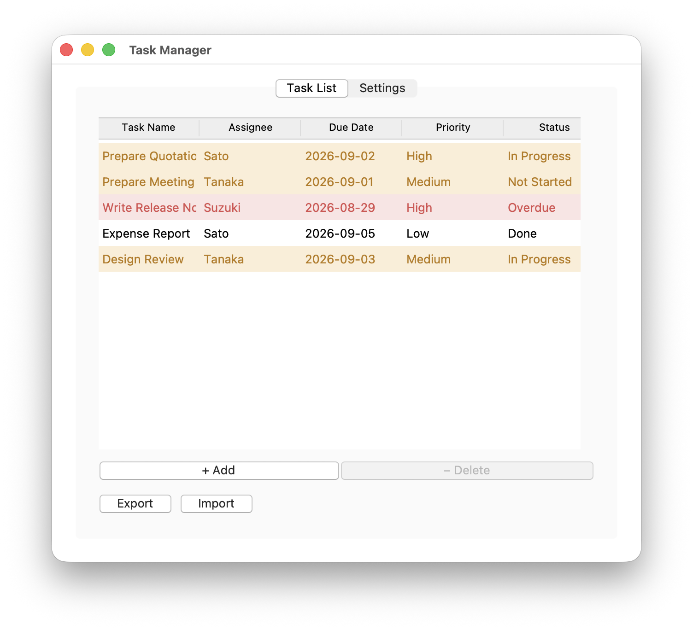
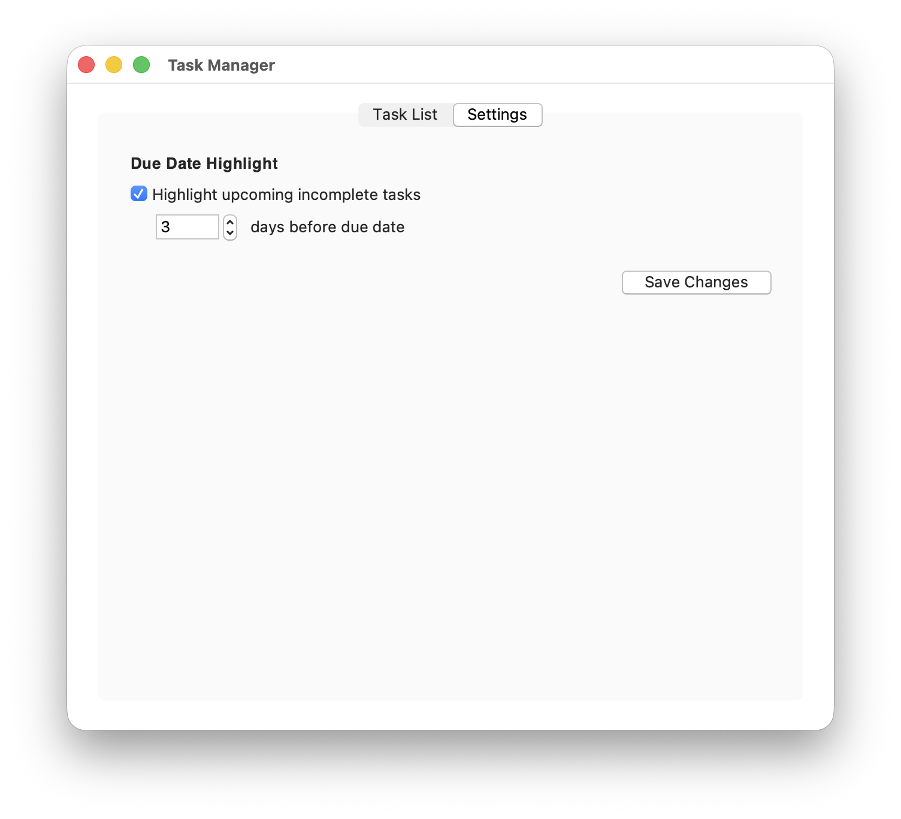

# mvp-pattern-sample-2

English | [日本語](README_ja.md)

A tabbed task-management desktop app written in Python (Tkinter). Under the hood it is a
sample implementation of the MVP (Model-View-Presenter) pattern, and a follow-up to
[mvp-pattern-sample-1](https://github.com/yanyayanyan1988/mvp-pattern-sample-1).

> ℹ️ The GUI is in English; the code comments and this README are in Japanese.

## Screenshots

| Task List | Settings |
|---|---|
|  |  |

---

## Using the app

### What it does

- Shows all tasks in a table and lets you edit cells in place — there is no separate registration form
- Highlights rows whose due date is near or past (orange = due soon, red = overdue)
- Exports tasks to a CSV file / imports them from one
- Saves every change automatically (no Save button); `app.db` is backed up automatically at a set interval

### Run it

`tkcalendar` is required (the due-date calendar picker), so create a virtual environment at the
repository root first. It's a GUI app, so run it where Tcl/Tk is available.

**macOS / Linux**

```bash
python3 -m venv .venv
.venv/bin/pip install -r requirements.txt
.venv/bin/python -m task_manager_tkinter.main
```

**Windows (Command Prompt / PowerShell)**

```bat
python -m venv .venv
.venv\Scripts\pip install -r requirements.txt
.venv\Scripts\python -m task_manager_tkinter.main
```

On first launch, `task_manager_tkinter/data/app.db` (SQLite) is created and seeded with 5 demo tasks.
Ways to launch other than `-m` are collected under "Running: other ways" below.

### How to use

#### Task List tab

| To do this | Do this |
|---|---|
| Edit a value | Double-click a cell to edit it in place. Priority and status are dropdowns; the due date is picked from a calendar |
| Sort | Click a column header; click again to toggle ascending/descending (shown as ▲/▼). Priority and status sort by meaning (Low→High, Not Started→…→Overdue), not alphabetically. Rows with a blank value always sink to the bottom |
| Add | "+ Add". A blank task is appended and selected (only the name gets a placeholder, "Task N"). Fill in the rest by editing cells, same as any other row |
| Delete | Select a row, then "− Delete" → confirm with Yes. Shift/Cmd-click to multi-select and delete several at once |
| CSV in/out | "Export" / "Import" |

Automatic due-date behavior:

- Editing a due date to a **past date** auto-sets that task's status to "Overdue" — only at that moment (Done tasks excluded). After that, a manually chosen status wins; it is not enforced continuously.
- A row whose status is manually set to "Overdue" is always red, even if the due date is in the future (Done tasks excluded).
- On CSV import, the status written in the file is kept as-is; the auto-set above does not run.

#### Settings tab

- **Due-date highlight**: toggle on/off and set how many days ahead to warn. Toggling applies to the task list immediately. Done tasks are excluded.
- **Backup interval**: how often (in minutes, default 15) automatic backups run. Changing it while running takes effect from the next timer tick.
- Every changed value is saved the moment you enter it (Auto Save).

---

## Reading the design

This is what the repository is really about: how responsibilities are split across MVP
(Model / View / Presenter).

### The point

A sample built around a Tkinter desktop app that could plausibly exist in a real workplace —
one with tabs for a task list and settings — with responsibilities separated according to the
MVP pattern. Tabs and buttons deliberately keep the OS-native look (the default `ttk.Notebook` /
`ttk.Button` style).

### Persistence and backups

Both tasks and settings are persisted to SQLite (the standard-library `sqlite3` module — no extra
install needed). **Edits are always written to the database immediately** (Auto Save). There's no
Save button, no "unsaved changes" indicator, and no confirm-on-quit dialog. You never have to think
about saving — but there's also no way to undo a mistake by simply not saving (the automatic backup
below is the only safety net).

At the configured interval (default 15 minutes) the app checks whether `app.db` has changed and, if
so, copies it to `data/backups/` (skipped if nothing changed since the last backup). It keeps only
the newest **24 hours** and deletes anything older (retention by elapsed time, not by count). This
protects against the database *file* becoming unreadable (disk failure, filesystem corruption).
SQLite's transactions already guard against a crash mid-write, but not against the file itself being
lost or corrupted outright.

### Folder Structure

```
task_manager_tkinter/         Root package (folder hierarchy == class namespace)
    main.py                   Entry point (same level as model, view, presenter)
    test_presenter.py         Unit tests for the two Presenters (no tkinter required)
    data/                     Where the SQLite database (app.db) lives; created automatically at runtime
        backups/               Backups of app.db, made automatically at the configured interval (last 24h kept)
    model/
        lib/                  Home for pure-I/O modules that hold no class
            db_path.py            The DB file's default path (shared by task/settings)
            db_backup.py          Backs up and rotates app.db (pure I/O)
            task_db.py            Task persistence (SQLite), pure I/O, no tkinter dependency.
                                   save() writes the whole in-memory state at once
            settings_db.py       Settings persistence (SQLite), pure I/O, no tkinter dependency
            csv_io.py            CSV export/import (pure I/O, no tkinter dependency)
        task/
            entity.py           Task (data class) + PRIORITIES / STATUSES
            store.py            TaskModel (holds the in-memory task set, delegates persistence)
        settings/
            entity.py           Settings (data class)
            store.py            SettingsModel
    view/
        callbacks.py            CallbackRegistryMixin (callback-registration mixin shared by both tk_frame files)
        task/
            contract.py         TaskListView (abstract class = the contract the Presenter depends on)
            tk_frame.py         Tkinter implementation (Task List tab)
        settings/
            contract.py         SettingsView (abstract class = the contract the Presenter depends on)
            tk_frame.py         Tkinter implementation (Settings tab)
        tk_main_window.py      Tkinter implementation (the window that combines both tabs)
    presenter/               (one file per tab; no subfolders)
        task.py                TaskListPresenter
        settings.py            SettingsPresenter
```

Under `model` / `view`, file names carry only the **role** (`entity` / `store` / `contract` /
`tk_frame`); which tab they belong to is shown by the **folder** (`task` / `settings`). Neither
the folder name nor the layer name (`view`, …) is repeated in the file name. `presenter` has just
one class per tab, so it skips the subfolder and puts `task.py` / `settings.py` directly under
`presenter/`.

The `model` / `view` subfolders are directly the import namespace of the classes inside them
(e.g. `model/task/` ⇔ `task_manager_tkinter.model.task.TaskModel`). Each subpackage's
`__init__.py` re-exports its public classes, so callers import by the dotted path of the
containing folder (`from task_manager_tkinter.model.task import TaskModel`). For presenter it is
`from task_manager_tkinter.presenter.task import TaskListPresenter` (straight from
`presenter/task.py`).

`view/tk_main_window.py` combines both tabs and so stays directly under `view/`. `view/callbacks.py`
likewise belongs to no single tab — it is a view-layer mixin, so it also sits directly under `view/`.
`TkTaskListFrame` / `TkSettingsFrame` multiply inherit as `(ttk.Frame, CallbackRegistryMixin,
<contract>)` and delegate only callback registration/dispatch to the mixin (which has no `__init__`,
so it never interferes with tkinter's `super().__init__` chain).
**Pure-I/O modules that hold no class** (`db_path` and friends) are collected under `model/lib/`.

### Responsibility of Each Layer

| Layer | Class | Responsibility | Depends on |
|---|---|---|---|
| Model | `TaskModel` | Domain logic for holding, adding (including blank tasks), updating, and deleting tasks. Edits only change the in-memory state; persistence is delegated to `task_db` only when `save()` is called (and `TaskModel` doesn't know any SQL itself). Knows nothing about the UI either. | `task_db` |
| Model | `SettingsModel` | Domain logic for holding and updating settings. Delegates the persistence details (SQLite) to `settings_db` and doesn't know any SQL itself. | `settings_db` |
| Model | `task_db` / `settings_db` (`model/lib/`) | Saves/loads tasks and settings to/from SQLite. Pure I/O functions, no tkinter dependency. | `db_path` (where the DB file lives) |
| Model | `db_backup` | Backs up `app.db` with a timestamp and deletes backups older than a given retention window (default 24h). Pure I/O functions; main.py owns the call cadence, read from `SettingsModel` (default 15 minutes). | none |
| Model | `csv_io` | Exports/imports tasks to/from CSV. Pure I/O functions. | none |
| View (abstract) | `TaskListView` / `SettingsView` | Define the "contract" for each tab (rendering, reading input, registering handlers). | none |
| View (impl) | `view/task/tk_frame.py` (`TkTaskListFrame`) / `view/settings/tk_frame.py` (`TkSettingsFrame`) / `view/tk_main_window.py` (`TkMainWindow`) | Concrete implementation of the above abstractions using Tkinter (`ttk.Notebook` + standard widgets). | the View abstractions, tkinter |
| Presenter | `TaskListPresenter` / `SettingsPresenter` | Holds the "screen behavior" logic for each tab: validation, updating the Model, tracking the list's sort state, adding/deleting tasks, CSV export/import, and determining the due-date highlight. On every `refresh()` (or `on_field_changed()`), saves immediately if there's anything unsaved (Auto Save). `TaskListPresenter` also reads `SettingsModel` to get the highlight criteria (on/off, how many days ahead). | the corresponding Model(s) (`TaskListPresenter` depends on both `TaskModel` and `SettingsModel`), the corresponding View (abstract only) |

Because each Presenter depends only on its View abstraction, swapping the View implementation
(Tkinter / another GUI library / a fake View for testing) requires no change to the Presenter code.
Likewise `TaskModel` / `SettingsModel` hide their persistence behind `task_db` / `settings_db` —
switching from an in-memory-only implementation to SQLite (write-through on every change) required no
changes to Presenter or View at all (the history is in "Design notes").

### Data Flow (clicking "+ Add")

1. The user clicks "+ Add" on the "Task List" tab.
2. The handler registered with `TkTaskListFrame` (`TaskListPresenter.on_add_click`) is invoked.
3. The Presenter calls `TaskModel.add_blank_task()`. The Model adds a task with every field blank,
   automatically filling the name with a placeholder like "Task N" using the id it just assigned.
4. It calls `refresh()` to update the list, then `view.select_task(task.id)` to select the new row.
   The existing rows' order (including any active sort result) is left untouched — only the new
   task is appended at the end.
5. The user double-clicks cells on that selected row to fill in the assignee, due date, priority, and
   status via the same inline-editing mechanism used for any other task.

### Design notes

- **How Auto Save came to be**: it started as in-memory-only, then SQLite write-through. A later
  redesign replaced write-through with an explicit `save()` behind a Save button (plus an "unsaved
  changes" indicator and a confirm-on-quit dialog), so a mistake could be discarded by simply not
  saving — but deciding where that button should live turned into its own recurring design problem.
  In the end the simplest option won: back to saving on every change (Auto Save, no button), with the
  periodic backup as the safety net instead. Across all of this, Presenter/View changes were only
  ever needed when the *user-facing* behavior changed (a button, a dialog, an indicator) — the Model's
  persistence mechanism itself (in-memory vs. SQLite) never required touching Presenter or View.
- **Time-based backup retention**: "the last 24 hours", not "the last N backups". Changing the backup
  interval later (15 min → 1 min, say) then doesn't break the "one day of history" guarantee without
  a code change.
- **Auto-Overdue fires once**: the status is auto-updated only at the moment the due date is edited to
  a past date, never enforced continuously — so a manual status change is respected afterward.

### Running: other ways

Both `-m` and a plain file path work. `main.py` / `test_presenter.py` prepend the repository root to
`sys.path` only when they detect they were run as a plain script (`__package__` unset), so the same
absolute imports resolve either way.

```bash
# from the repository root (the parent of task_manager_tkinter/)
.venv/bin/python -m task_manager_tkinter.main
.venv/bin/python task_manager_tkinter/main.py
cd task_manager_tkinter && ../.venv/bin/python main.py
```

Windows:

```bat
.venv\Scripts\python -m task_manager_tkinter.main
.venv\Scripts\python task_manager_tkinter\main.py
```

### Testing

By swapping in fake Views (fake implementations of each View abstract class) instead of `TkMainWindow`
(and its internal Frames), the two Presenters' logic is verified without ever starting Tkinter.
`test_presenter.py` depends only on the `view.*` packages (the `TaskListView` / `SettingsView` abstract
classes) and never imports the Tkinter implementation under view (`view/task/tk_frame.py` /
`view/settings/tk_frame.py` / `view/tk_main_window.py`), so it runs fine even without tkinter
installed (the `__init__.py` files under `view/` re-export only the abstract classes). `TaskModel` /
`SettingsModel` are constructed with `db_path=":memory:"` in tests, so nothing is written to disk and
each test gets its own isolated database.

```bash
# from the repository root (either works)
python3 -m task_manager_tkinter.test_presenter
python3 task_manager_tkinter/test_presenter.py
```

CI also runs the same tests on every pull request and every push to `main` (see `.github/workflows/test.yml`).

### Prerequisites

- Python 3.14 (Homebrew build)
- Using tkinter requires `brew install python-tk@3.14` separately (the deprecated Tcl/Tk 8.5.9 bundled with macOS's `/usr/bin` Python is not used)
- Running the GUI requires `tkcalendar` (see `requirements.txt`). Not needed to run `test_presenter.py`
- Persistence uses `sqlite3` (Python's standard library), so no extra install is needed for that

#### A note on Windows

The code only uses cross-platform `tkinter` / `ttk` / `tkcalendar` APIs and has no macOS-only
dependency, so it should run on Windows too (development and testing were only done on macOS).

- The official python.org Windows installer bundles Tcl/Tk, so there's no equivalent of
  `brew install python-tk@3.14` to install separately
- The Settings tab's section header uses `font=("Helvetica", 10, "bold")`; "Helvetica" isn't a standard
  Windows font, but Tk silently falls back to a substitute instead of raising an error, so this only
  affects appearance, not functionality
