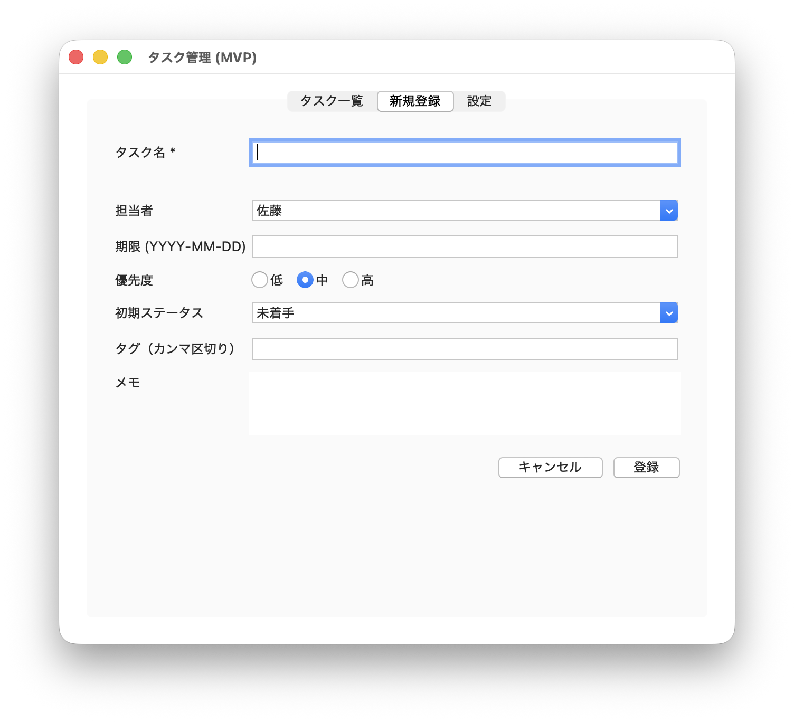

# mvp-pattern-sample-2

[English](README_en.md) | 日本語

Python (Tkinter) による MVP（Model-View-Presenter）デザインパターンのサンプル実装。
[mvp-pattern-sample-1](https://github.com/yanyayanyan1988/mvp-pattern-sample-1) の続編で、
「タブ付きの実務寄りなタスク管理アプリ」を題材にしている。

## スクリーンショット

| タスク一覧 | 新規登録 | 設定 |
|---|---|---|
|  |  |  |

## 目的

タブごとに異なる画面（タスク一覧・新規登録・設定）を持つ、実務でありそうなTkinterデスクトップアプリを題材に、
MVPパターン（Model / View / Presenter）で責務を分離して実装したサンプル。

## 機能

- **タスク一覧タブ**: 登録済みタスクを表（`ttk.Treeview`）で一覧表示する。
  - セルをダブルクリックするとその場で編集できる（タスク名・担当・期限・優先度・ステータス）。
    優先度・ステータスは選択式（プルダウン）にして、不正な値が入らないようにしている。
  - 期限は`tkcalendar`のカレンダーをポップアップ表示して選択する。「現在の期限」を常時表示し、
    「この日に戻る」ボタンで月を移動しても元の設定に迷わず戻れる。
  - カラムヘッダーをクリックするとその列でソートする。同じ列を再クリックすると昇順/降順が
    切り替わり、見出しに▲/▼で表示される。優先度・ステータスは五十音順ではなく、
    意味のある順序（低→中→高、未着手→...→遅延）でソートされる。
- **新規登録タブ**: タスク名・担当者・期限・優先度・初期ステータス・タグ・メモを入力して登録する。
  - タスク名が未入力の場合はエラーメッセージを表示し、登録を行わない。
  - 「キャンセル」でフォームをクリアする。
- **設定タブ**: 通知（ON/OFF・タイミング）・既定の担当者・一覧の表示件数・テーマを設定する。
  - 値を変更すると「未保存の変更があります」と表示され、「変更を保存」を押すまで反映されない。
  - タスクをCSVファイルへの書き出し／CSVファイルからの読み込みができる。

タブ自体はあえてOS標準に近い見た目（`ttk.Notebook`のデフォルトスタイル）のままにしている。

## フォルダ構成

```
task_manager_tkinter/
    main.py                   エントリーポイント（Model, View, Presenterと同じ階層）
    test_presenter.py         3つのPresenterの単体テスト（tkinter不要）
    Model/
        task.py                Task（データクラス）
        task_model.py          TaskModel
        settings_model.py      Settings（データクラス）/ SettingsModel
        csv_io.py               CSV書き出し/読み込み（tkinterに依存しない純粋なI/O）
    View/
        task_list_view.py      TaskListView（抽象クラス）
        new_task_view.py       NewTaskView（抽象クラス）
        settings_view.py       SettingsView（抽象クラス）
        tk_main_window.py      Tkinter実装（3タブぶんのFrame + ウィンドウ全体）
    Presenter/
        task_list_presenter.py
        new_task_presenter.py
        settings_presenter.py
```

## 各層の責務

| 層 | クラス | 責務 | 依存先 |
|---|---|---|---|
| Model | `TaskModel` | タスクの保持・追加・更新（一覧のインライン編集用）のみ。UIのことは一切知らない。 | なし |
| Model | `SettingsModel` | 設定値の保持・更新のみ（メモリ上のみ、永続化はしない）。 | なし |
| Model | `csv_io` | タスクのCSV書き出し/読み込み。純粋なI/O関数。 | なし |
| View（抽象） | `TaskListView` / `NewTaskView` / `SettingsView` | 各タブの「契約」（表示・入力取得・ハンドラ登録）を定義。 | なし |
| View（実装） | `tk_main_window.py`（`TkTaskListFrame` / `TkNewTaskFrame` / `TkSettingsFrame` / `TkMainWindow`） | 上記の抽象をTkinter（`ttk.Notebook` + 標準ウィジェット）で実装。 | 各View抽象, tkinter |
| Presenter | `TaskListPresenter` / `NewTaskPresenter` / `SettingsPresenter` | 各タブの「画面の振る舞い」のロジック。バリデーション・Model更新・タブ間の連携（新規登録後に一覧を更新するなど）・一覧のソート状態管理を担う。 | 対応するModel, 対応するView（抽象のみ） |

各PresenterはそれぞれのView抽象にしか依存していないため、View側の実装を差し替えても（Tkinter／別のGUIライブラリ／テスト用のFakeViewなど）Presenterのコードは変更不要。

## データフロー（新規登録タブで登録した時）

1. ユーザーが「新規登録」タブでタスク名などを入力し、「登録」ボタンを押す。
2. `TkNewTaskFrame`に登録済みのハンドラ（`NewTaskPresenter.on_register_click`）が呼ばれる。
3. Presenterがタスク名の入力チェックを行い、空なら`view.show_name_error(...)`でエラー表示して終了。
4. 問題なければ`TaskModel.add_task()`でタスクを追加し、`view.clear_form()`でフォームをクリア。
5. コンストラクタで渡された`on_task_added`コールバック（`TaskListPresenter.refresh`）を呼び、タスク一覧タブの表示を最新化する。

## 実行方法

`tkcalendar`（期限のカレンダー選択に使用）が必要なため、リポジトリ直下に仮想環境を作ってから実行する。
GUIを使うため、Tcl/Tkが使える環境で実行すること。

```bash
python3 -m venv .venv
.venv/bin/pip install -r requirements.txt

cd task_manager_tkinter
../.venv/bin/python main.py
```

## テスト方法

`TkMainWindow`（および内部の3つのFrame）の代わりにFakeView（各View抽象クラスの偽実装）を差し込むことで、
Tkinterを一切起動せずに3つのPresenterのロジックを検証する。

`test_presenter.py`は各`View.*_view`（抽象クラス）のみに依存し、`View.tk_main_window`（Tkinter実装）は
読み込まないため、tkinterが入っていない環境でも実行可能。

```bash
cd task_manager_tkinter
python3 test_presenter.py
```

CIでも、PR作成時・`main`へのpush時に同じテストが自動実行される（`.github/workflows/test.yml`）。

## 前提環境

- Python 3.14（Homebrew版）
- tkinter利用には `brew install python-tk@3.14` が別途必要（macOS標準の`/usr/bin`側は非推奨のTcl/Tk 8.5.9のため使用しない）
- GUIの実行には`tkcalendar`が必要（`requirements.txt`参照）。`test_presenter.py`の実行には不要
